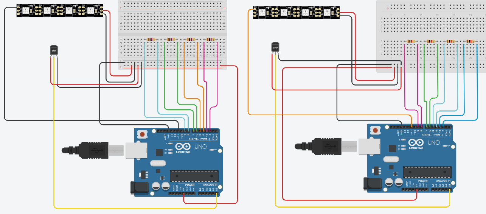

# Touch-Me-Not
Have you ever wondered what it's like to have synaesthesia? This project presents an immersive sensory experience to 
entertain and explore a different understanding of the world. Challenge your senses and ignite your imagination through
touch, sound, and vision.

This project aims to provide users with an immersive synesthesia experience in which they can touch different materials 
and in turn experience audio and light.

To run this code, see 'Installation'.

## Modules
### Synaesthesia Experience
`main.py`: Plays sounds using pre-processed output of sound_generator.py and sensor values from the arduino.

`arduino_serial.py`: Handle Arduino input.

`instrument.py`: Handle the playing, stopping and information storing of instruments.

`sound.py`: Wrapper for pygame sounds.

### Generate Audio
`sound_generator.py`: Generates a library of sounds from a given jobfile using the samples in audio_generator/sound_components. Generates an instruction file for `main.py` to use in filename selection.

### Testing
The files in `/testing` allow this project to be executed through keyboard input instead of with Arduinos. See 
'Installation' for instructions on how to use this functionality.

The testing files contain some functionality that we were not able to fully implement and user test.

## Dependencies
### Synaesthesia Experience
- python3: Version 3.10
- pyserial: `pip3 install pyserial`
- pygame: `pip3 install pygame` - Version 2.1.2

### Arduino
Two Arduino Uno Rev3 boards.

The following libraries installed to the Arduino IDE:
- Adafruit NeoPixel 1.10.6
- CapSense 0.5.1

Two LED strips, the [datasheet for which can be found here](https://www.jaycar.com.au/medias/sys_master/images/images/9700136517662/XC4390-dataSheetMain.pdf).

### Generate Audio
This is run on mac or linux terminals. Required libraries:
- zsh: see https://www.zsh.org/
- sox: see https://sox.sourceforge.net/

## Installation
### Setup
1. Install the required dependencies
2. Connect the Arduinos capacitance and light sensors to the objects and plug LED strips into Arduinos.
   1. See wiring diagram below
       
3. Export the Arduino code onto the two Arduinos:
   1. `/LED_controller/left_LED_controller/left_LED_controller.ino` for the left Arduino
   2. `/LED_controller/right_LED_controller/right_LED_controller.ino` for the right Arduino
4. Plug the two Arduino USB cables into the computer and note the port names (see Troubleshooting).

### Wiring Diagram

The above wiring diagram contains the left Arduino on the left side and the right Arduino on the right side. For each 
it is colour-coded as follows:
- Green: Plant 1
- Turquoise: Plant 2
- Yellow: Lamp photoresistors
- Orange: Dragonfly
- Pink: Flower
- Blue: Water
Note that the temperature sensors in the diagram are intended to be photo resistors.

#### Synaesthesia Experience

### Testing
The code can be tested without Arduinos using keyboard input. To do this:
1. Change working directory to `testing/`
2. Run `main.py -k`

The program will open a pygame window, where you may enter the numbers 0-9 to play instruments 0 through 9.

Full usage: 
```
python3 main.py [username] [-m cooldown] [-k]
	username: name of new or existing user
		(used to select port names)
	-m cooldown: use modulation mode with modulation cooldown period in seconds
		(changes musical key when an object is touch after cooldown period)
	-k: use keyboard keys 0-9 to represent object touches instead of Arduino input
		(may not work on systems with incompatible key mappings)
```

### Generate Audio: Generate
Change working directory to `audio_generator/`. Only works on unix-based OS with sox installed.
Usage: 
```
python3 generate_sounds.py jobfile
	jobfile: file specifying the instruments, their sounds, and the layers of each sounds.
		(instruments correspond to objects, layers are the wav files comprising each sound, see Generate audio: jobfile)
```

### Generate Audio: Jobfile:
The jobfile tells the audio generator what sounds to make and how to edit them.

Define instruments first: `instrument instrument_name key range_mode balance`
- instrument_name: name of the object
- key: musical key associated with the object
- range_mode: range of sounds to generate for object (chord, scale, or arpeggio)
- balance: left-right balance of the object's generated sounds in format LxRy where x and y are the volume scale factor of each of the wav's stereo channels

e.g. 
```
instrument water C_sharp_major chord L1R1
```

Then define sounds with their layers listed below:
```
sound instrument_name sound_name sound_volume_scale_factor
	- filename note layer_volume_scale_factor
	- ...
		instrument_name: name of the object this sound is assigned to
		sound_name: name of the sound (impact or hold)
		sound_volume_scale_factor: scale factor for the volume of this sound (applied after layers are merged)
		filename: name of the layer's filename
		note: note of the layer in format, "X_sharp", for the semitone above note X
		volume_scale_factor: scale factor for the volume of this wav file
```

e.g.
```
sound flowerR hold 1.2
- sound_components/Flower/sparky_drone_G#.wav G_sharp 0.5
- sound_components/Flower/vocals_G.wav G 1.5
- sound_components/Flower/bees.wav none 0.1
```

Lines beginning with anything other than "instrument", "sound", or "-" will be ignored.

## Troubleshooting
```[Errno 2] No such file or directory: '/dev/cu.usbmodem1101'```

This issue is related to the port main.py is trying to read the arduino input from. 
[This link should show you how to find the suitable port for your computer.](https://www.mathworks.com/help/supportpkg/arduinoio/ug/find-arduino-port-on-windows-mac-and-linux.html)

For mac computers, the ports will look similar to the following:
- `/dev/tty.usbmodem14201`
- `/dev/cu.usbmodem1101`

These can be found using the command `ls /dev/*`
